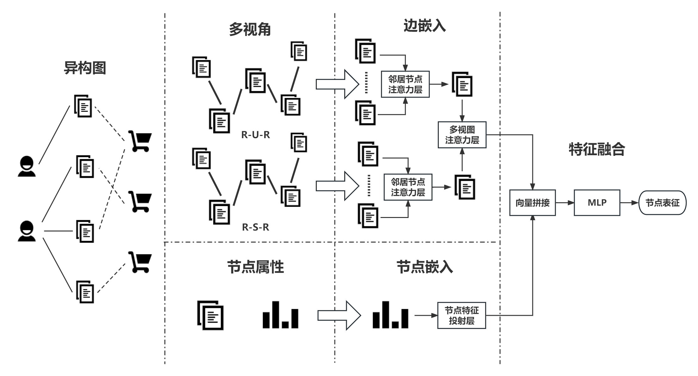
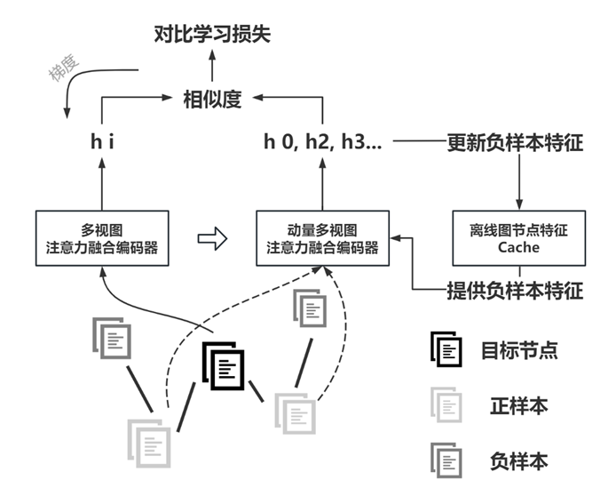

# MoGCL：Momentum Graph Contrastive Learning

```
多视图动量对比学习模型
本项目为本科毕业设计，仅供学习使用
```

## 多视图注意力融合编码器



## 多视图动量对比学习模型



## 所需环境

- MinConda（建议使用）
- python3.6/3.7/3.8
- pycharm（IDE）
- pytorch 1.20（pip package）
